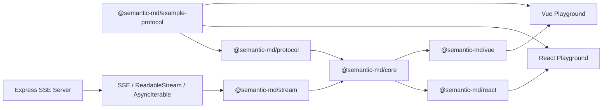

# Semantic Markdown

Semantic Markdown 是一个面向 AI 流式输出的 TypeScript SDK。它让标准 Markdown
在生成过程中尽早形成可渲染结构，同时允许业务注册可校验、可安全降级的 Inline、
Block 和 Container 语义节点。React 与 Vue 适配器消费同一份框架无关 AST。

> 让 AI 以可读 Markdown 输出内容，同时携带可校验、可流式解析、可由 React/Vue
> 自定义渲染的业务语义。

## 架构



Core 使用“已稳定前缀 + 活动尾部”模型。稳定前缀只在安全边界推进时解析一次，
活动 Block 可以局部重解析；流结束时执行一次规范解析，保证最终 AST 与完整字符串
解析语义等价。

## 环境与安装

- Node.js 20.19+
- pnpm 10+

```bash
pnpm install
cp .env.example .env
```

## 启动 Playground

```bash
pnpm dev
```

也可以分别启动：

```bash
pnpm dev:server  # http://localhost:4100
pnpm dev:react   # http://localhost:5173
pnpm dev:vue     # http://localhost:5174
```

Server 提供：

```text
GET /api/stream?scenario=full&speed=20&chunkMode=syntax-boundary&seed=1
GET /api/scenarios
```

## 定义协议

```ts
import { defineProtocol } from "@semantic-md/protocol";
import { z } from "zod";

export const protocol = defineProtocol({
  version: "1.0.0",
  nodes: {
    increase: {
      kind: "inline",
      schema: z.object({
        value: z.coerce.number(),
        unit: z.enum(["percent", "currency", "count"]),
      }),
      fallback: "children",
      renderPending: true,
    },
  },
});
```

协议定义不会进入 Core 的业务逻辑；Core 只通过封装后的 `safeParse` 契约调用 Schema。
`generateProtocolPrompt(protocol)` 可生成供模型使用的节点语法说明。

## React

```tsx
import { SemanticMarkdown } from "@semantic-md/react";

<SemanticMarkdown
  content={content}
  protocol={protocol}
  components={semanticComponents}
  streamingMode="balanced"
  onAction={(action) => console.log(action)}
/>;
```

流式场景使用 `useSemanticMarkdown()` 返回的 `push`、`finish`、`reset` 和
`document`，再将 `document` 传给 `SemanticMarkdown`。

## Vue

```vue
<script setup lang="ts">
import { SemanticMarkdown } from "@semantic-md/vue";
</script>

<template>
  <SemanticMarkdown
    :content="content"
    :protocol="protocol"
    :components="semanticComponents"
    streaming-mode="balanced"
    @action="handleAction"
  />
</template>
```

流式场景对应使用 `useSemanticMarkdown()` composable。

## 输入适配

`@semantic-md/stream` 提供 `consumeReadableStream`、`consumeAsyncIterable` 和
`connectSemanticSse`。也可以直接调用 Core session 的 `push(chunk)`。EventSource
的 `delta` 内容始终被当作不可信文本解析，永不执行 JSX、Vue Template、HTML 或
action。

## 质量命令

```bash
pnpm lint
pnpm typecheck
pnpm test
pnpm build
pnpm test:e2e
pnpm benchmark
```

测试覆盖完整解析、随机分片最终一致性、Patch、危险 URL、协议验证、流适配、
React/Vue 语义组件和 SSE 顺序。Playwright 覆盖两个 Playground 的流式与 malformed
恢复路径。

## 安全默认值

- HTML 只作为文本 VNode/ReactNode 渲染，不注入 DOM。
- 链接只允许 `http:`、`https:` 和相对 URL。
- 拒绝 `style`、`class`、`className`、`innerHTML`、`srcdoc` 和所有 `on*` 属性。
- Action 只能由开发者组件通过 render context 上报。
- 未知节点默认保留可见子内容。

## 当前限制

- Setext 标题、极端 CommonMark 歧义和跨空行复杂嵌套列表采用保守流式策略。
- GFM 表格必须等待分隔行才能确认。
- Pending 代码块不做语法高亮。
- `finish()` 会执行一次完整规范解析；这是用于最终正确性协调的设计。
- `push()` 为调用方立即返回 Patch；订阅通知默认以 16ms 合并。
- 活动尾部边界以空行、ATX 标题、闭合围栏和闭合 Container 为主；复杂块在
  `finish()` 前可能保持 Pending。

更详细的设计见 [架构](docs/architecture.md)、[协议](docs/protocol.md)、
[流式策略](docs/streaming.md)、[API](docs/api.md) 和
[完整目录树](docs/directory-tree.md)。
